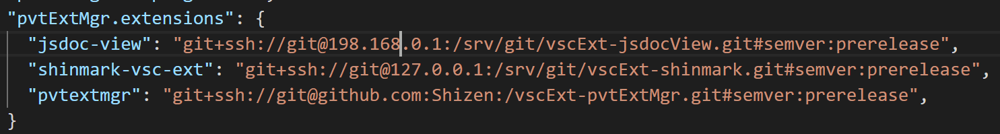

<base href="https://shizen.github.io/pvtExtMgr">

[Test link](index.html)

# pvtExtMgr (Private Extension Manager)

The purpose of this extension is to allow you to setup and maintain extensions for your vscode installation which are "automatically" kept up to date with a \[private\] git server.  To this end, this module follows the same pattern as `npm` for specifying and tracking versions of npm modules\*.  This module allows the user to specify in this module's settings a `dependencies`-like list of `#semver` npm references to a git server and semver version specification for the desired version of the extension they would like to have installed.  The primary goal is to support user developed and private extensions in vscode.  

Note that the actual semver math is done by [`semver-extra`](https://www.npmjs.com/package/semver-extra), which, among other things, allows you to specify `:prerelease` as a semver specification which will match against prelrease versions of the package (to get the latest possible version--`:prerelease` is an alias for `max()` in `semver-extra` terminology).  See [`semver-extra`](https://www.npmjs.com/package/semver-extra) for more details.

## Features

- Allows the user to trigger (manually for the moment), the checking for updates to extensions stored in git repos according the user settings for this extension.
- Can be made to keep a log of updates performed.

## Known Issues

- Sanitation of "private" ip addresses and the like has caused certain dev related facilities to fall down.

## Requirements

This extension requires that the user already have `git` and `npm` installed and included in their path.

## Extension Settings

`pvtExtMgr.extensions`
:   This is the most important setting for this extension.  This setting lists which extensions you want `pvtExtMgr` to update for you and via which rule.  This setting uses a subset of the `npm` `dependency` format--it will only accept `#semver` rules.  Any other format will be ignored.
  
    "pvtExtMgr.extensions": {
      "jsdoc-view": "git+ssh://git@127.0.0.1:/srv/git/jsdoc-view.git#semver:prerelease",
      "shinmark": "git+ssh://git@127.0.0.1:/srv/git/shinmark.git#semver:latest",
      "pvtExtMgr": "git+ssh://git@127.0.0.1:/srv/git/vscExt-pvtExtMgr.git#semver:~0.0.2"
    }

This setting does extend the `#semver` format to add `prerelease` and `latest` as options.  `latest` will follow the standard `dependencies` definition for versioning.  `prerelease` will take the latest version, including prereleases.  These maths are provided courtesy of the `semver-extra` module.

`pvtExtMgr.clean`
:   (defaults to true) If set to true, any module updated by this extension will also have a `git clean -f` run to remove any deleted files.

`pvtExtMgr.keepLog`
:   (defaults to false) If set to true, will cause this module to keep a log of its installation efforts in its extension directory.  Log management is a thing, and this extension doesn't make any attempt to manage them.  Intended primarily for troubleshooting.

## Known Issues

- I currently "update" extensions via fetch + checkout.  (which will `fetch` all branches of the given repos).
- Does not verify that the user has permissions to update the extension(s) in question.  To be clear, here I mean perms to modify the local file system.  This falls under error handling & robustness
- This module does not debounce for multiple instances.  By which I mean that it does not deal gracefully with the situation where a user has multiple instances of vscode open and executes an update from each of them at "the same time".  (Which is why this extension is setup currently to be triggered manually).
  - On a related note, this extension makes no attempt to notify *other* vscode instances that extensions have been altered and need to be reloaded.  VSCode itself appears hit or miss on noticing during informal testing, but this might well be related to whether a given extension was *activated*.
- This module has not been tested on the Mac or Linux (I don't have either setup atm).  Pathing may be dorked on such platforms.
- I have done no testing for any of the myriad of git security/setups that might be in place.  I use `ssh` with installed keys.
- Not tested with older versions of npm (only tested with npm 6).
- I could pretty print my dates more
- Could put in more detailed progress bar status updates

## Futures

- This extension currently only runs when triggered manually.  It could be extended to run when vscode starts up.
- It would be easy to add support for the "commitish" format as well.
- This extension now runs exclusively in async mode.  For performance reasons, update requests could be "grouped" to take advantage of processor speed.  Currently, updates are performed serially (in tandem).
- Settings to allow one to specify a specific git or npm client to use.
  - Support for custom credentials by extension
- Support to allow the user to trigger an update/check for a specific repos or with special conditions (no `npm install`, no `git clean`, etc.)

## Release Notes

- 0.0.2 : Initial Release